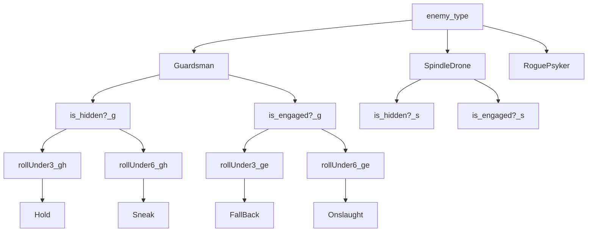

# Game aid for the Games Workshop game Blackstone Fortress

### Purpose: 
Blackstone Fortress uses enemy entity behaviour charts as an "AI" to control hostile NPCs. 
Figuring out what action to take is a time consuming process of using these lookup tables, finding where that action is defined and any sub/alternate actions. 

Given the *external* factor is a dice roll, if we can feed the conditions into a processor, and have it do all the grunt work. 

*Example:*

### Implementation:
Small python executable which takes user input about enemy models and their status, and spits out the appropriate enemy action

#### Notes
- While the actual *AI* cards display in a grid, because these grids are different for each class and thresholds span a range of dice values, it's quicker, easier to understand, and lighterweight to just use layered conditionals than to make an actual array with all the different outcomes for each class

- Actions are calculated and then passed into a `dictionary` for lookup. In the paper rules, some actions are on the card, some are in the book, and it's just a load of flicking back and forth.
  + Cascading or subconditional actions are handled with a `while loop`, which spits out the parent action, and then goes to see if their are any conditional alternate or secondary actions to perform
